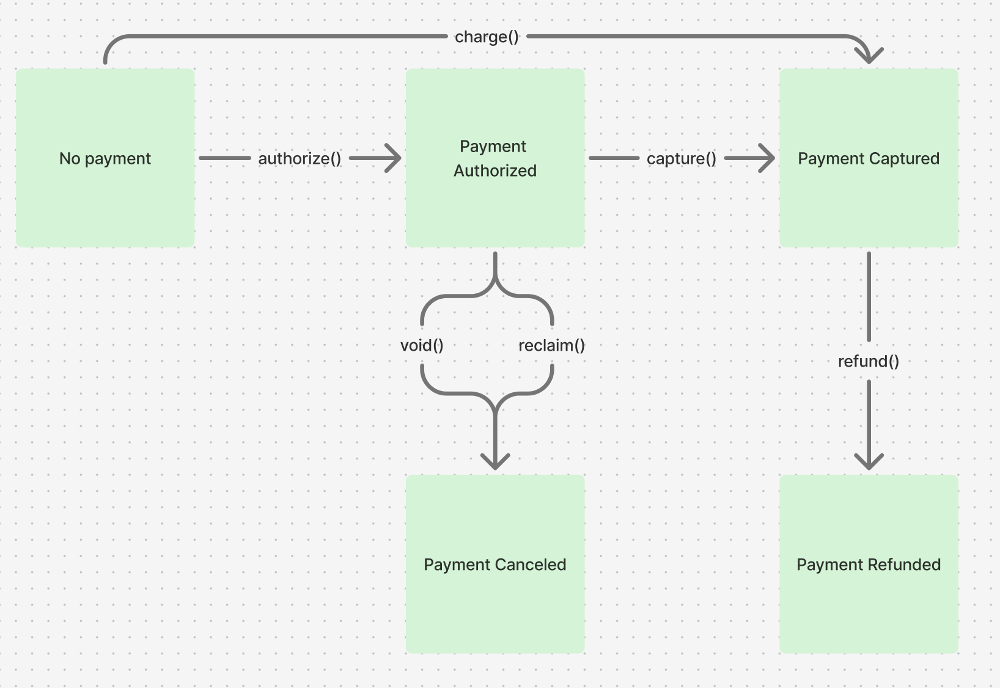
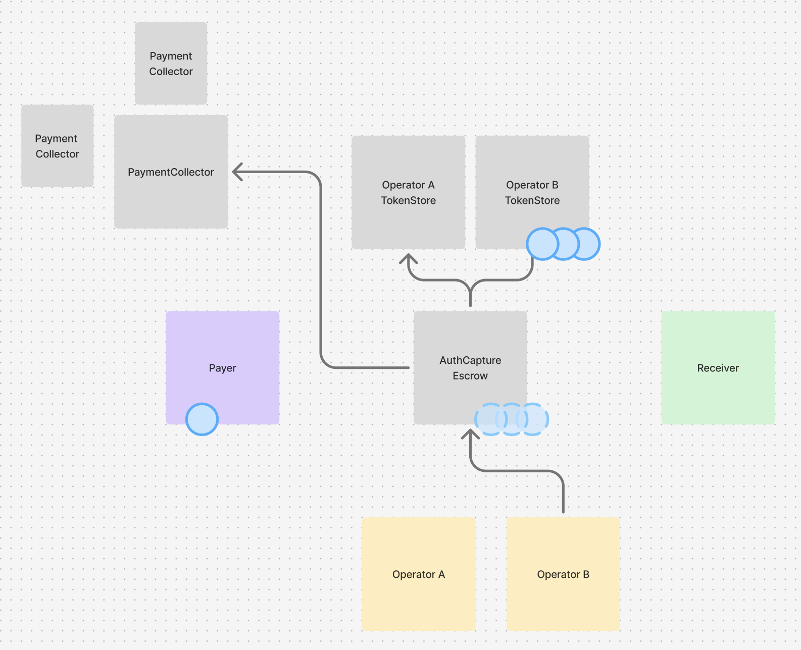

# Commerce Payments Protocol
## Overview

The Commerce Payments Protocol facilitates onchain payments. Traditional payment flows typically involve a multi-step "authorize and capture" pattern where payments are initially placed on hold to guarantee payment for merchants at a later time. This payment lifecycle helps facilitate the management of race conditions that can occur between checkout completion, payment processing, and actual order fulfillment (for example, inventory selling out, tax burdens changing, gift card balances being spent, etc.). The Commerce Payments Protocol is a permissionless, immutable mechanism designed to securely facilitate the multi-step lifecycle of real-world payments onchain.

Permissionless operators drive token movement through the protocol and can customize their operations with modular smart contracts. No top-level controls exist on the protocol, keeping it permissionless, immutable and usable by any operator. The permissionless nature of the core protocol prevents it from becoming a "walled garden" because anyone can act as an operator of the protocol and provide a layer of technical abstraction between merchants and the blockchain (including merchants themselves). Operators are trust-minimized and functionally restricted by the protocol, which tightly controls the flow of buyer and merchant funds and minimizes the potential for abuse by operators.


The protocol's core functionality revolves around two key concepts:

- **Authorization**: A commitment of funds for a future payment. When authorized, funds are held in escrow but not yet transferred to the merchant. This is similar to a "hold" on a credit card.
  
- **Capture**: Funds are transferred from escrow to merchants after fulfillment or other conditions ar met. Capture is guaranteed to succeed if funds have been authorized, providing merchants with payment certainty.


This pattern ensures that successful authorization always leads to successful capture, providing merchants with payment guarantees while maintaining buyer protections.

## Payment Lifecycle

The protocol provides six main functions that handle the complete payment lifecycle: `authorize`, `capture`, `charge`, `void`, `reclaim` and `refund`.

<div align="center">
  
  <p><em>Possible payment flows</em></p>
</div>

### Payment Initiation
- **[Authorize](Authorize.md)** - Reserve buyer funds in escrow for future capture. Enables delayed settlement while guaranteeing merchant payment upon successful authorization.

- **[Charge](Charge.md)** - Combine authorization and capture into a single transaction for immediate payment settlement.

### Payment Settlement  
- **[Capture](Capture.md)** - Transfer previously authorized funds from escrow to merchants. Supports partial captures and flexible fee distribution.

### Payment Cancellation
- **[Void](Void.md)** - Cancel payment authorizations and return escrowed funds to buyers. Only callable by the operator, but can be used to cancel a payment at any time.

- **[Reclaim](Reclaim.md)** - Allow buyers to recover funds from expired authorizations. Buyer-initiated safety mechanism callable only after authorization expiry.

### Payment Reversal
- **[Refund](Refund.md)** - Return previously captured funds to buyers using modular refund collectors. Supports partial refunds and flexible liquidity sourcing.


## Contract Architecture

<div align="center">
  
  <p><em>Commerce Payments Protocol smart contract architecture</em></p>
</div>

### 1. `AuthCaptureEscrow`
The main escrow contract that manages funds and payment lifecycle:
- Validates payment parameters and timing constraints
- Manages payment state (authorized, captured, refunded)
- Handles fee distribution
- Ensures atomic operations with reentrancy protection

### 2. Token Collectors
Pluggable payment modules that handle different authorization methods.
See [Token Collectors](TokenCollectors.md) for complete documentation.
- **ERC3009PaymentCollector**: Uses ERC-3009 `receiveWithAuthorization` signatures
- **Permit2PaymentCollector**: Uses Permit2 signature-based transfers
- **PreApprovalPaymentCollector**: Uses traditional ERC-20 allowances with pre-approval
- **SpendPermissionPaymentCollector**: Uses Coinbase's Spend Permission system
- **OperatorRefundCollector**: Handles refunds from operator funds

### 3. Token Stores
Per-operator token vaults that hold escrowed funds.
See [Liquidity Segmentation](Security.md#liquidity-segmentation-in-operator-tokenstores) for complete documentation.

- Deployed deterministically using CREATE2
- Isolated storage per operator for security
- Minimal proxy pattern for gas efficiency


## Payment Info Structure

Every payment is defined by a `PaymentInfo` struct containing immutable terms. A payment is uniquely identified by the hash of this struct, further hashed with the chain id and hashing contract address.

```solidity
struct PaymentInfo {
    address operator;           // Entity managing the payment flow
    address payer;              // Buyer's wallet address
    address receiver;           // Merchant's receiving address
    address token;              // Payment token contract
    uint120 maxAmount;          // Maximum amount that can be authorized
    uint48 preApprovalExpiry;   // When buyer's willingness to authorize the payment expires
    uint48 authorizationExpiry; // When an authorized payment can no longer be captured and can now be reclaimed
    uint48 refundExpiry;        // When refunds are no longer allowed
    uint16 minFeeBps;           // Minimum fee in basis points
    uint16 maxFeeBps;           // Maximum fee in basis points
    address feeReceiver;        // Fee recipient (0 = operator sets at capture)
    uint256 salt;               // Entropy for unique payment identification
}
```

## Fee System

The protocol implements a flexible fee mechanism with configurable rates and recipients. Fee parameters are defined in the `PaymentInfo` struct and validated during payment operations to ensure compliance with predefined constraints.

**📖 [Complete Fee Documentation](Fees.md)** - Deep dive into fee mechanics, validation rules, and examples.

## Security Model

The protocol incorporates multiple security layers including access controls, time-based constraints, balance verification, and liquidity segmentation. The trust-minimized operator model ensures that while operators control payment flows, they cannot steal funds and have limited ability to cause harm.

**🔒 [Security Analysis](Security.md)** - Comprehensive security features, risk assessment, and mitigation strategies including operator compromise scenarios and token denylist considerations.
