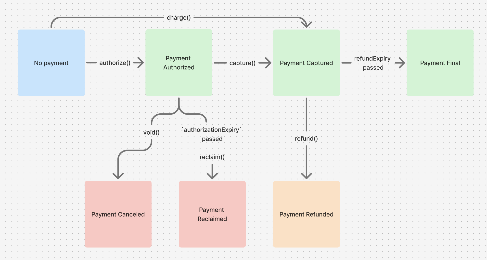
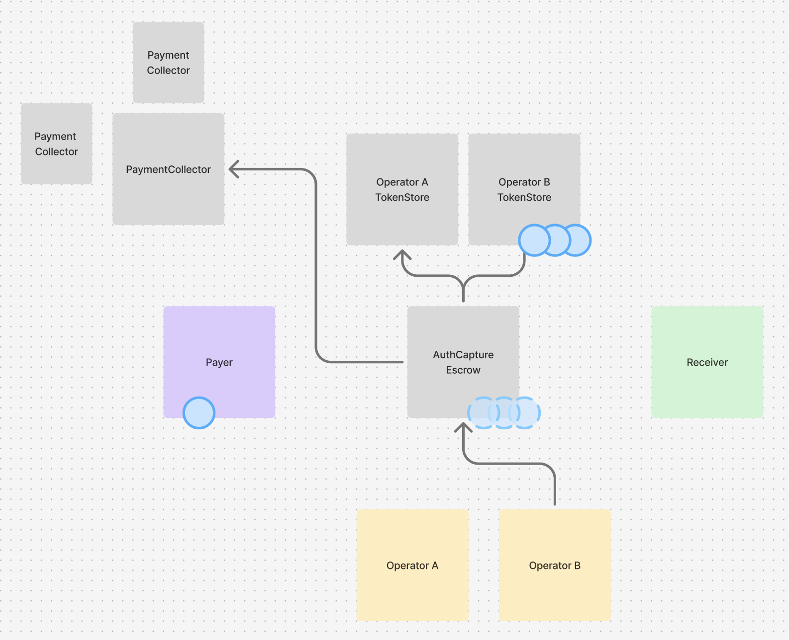

# Commerce Payments Protocol
## Overview

Today, onchain payments work well for peer-to-peer transactions, but not for more complex commerce purchases, which require features like refunds, delayed capture, and tax finalization. For example, in commerce, merchants can run out of inventory and need to cancel a purchase, buyers can request refunds, orders may be completed in multiple deliveries, and more. The Commerce Payments Protocol enables onchain payments for commerce at scale by bridging this gap.

Traditional finance’s solution is called "authorize and capture":
- **Authorization** places hold on buyer funds
- **Capture** distributes payment to the merchant

This introduces an intermediary state of guaranteeing the ability to pay in the future without actually having finalized payment right now. Until now, onchain payments have been missing this capability.

The Commerce Payments Protocol brings Auth+Capture onchain through an Escrow smart contract. To authorize, funds move from buyer to Escrow, guaranteeing the ability to pay merchants. To capture, funds move from Escrow to merchant, finalizing payment. This simple 2-step process unlocks onchain payments for commerce at scale.

To create a layer of abstraction between the payer or receiver of a given payment the need for direct interaction with the chain, the protocol is designed around the concept of a payment "operator". Operators drive payment movement through the Escrow, absorbing transaction fees and enabling background automations seamlessly.

 No top-level controls exist on the protocol, keeping it permissionless, immutable and usable by any operator. The permissionless nature of the core protocol prevents it from becoming a "walled garden" because anyone can act as an operator of the protocol and provide a layer of technical abstraction between merchants and the blockchain (including merchants themselves). Operators are trust-minimized and cryptographically constrained by the protocol, which tightly controls the flow of payer and merchant funds and minimizes the potential for abuse by operators.


## Payment Operations

The protocol provides six main functions that handle the complete payment lifecycle: `authorize`, `capture`, `charge`, `void`, `reclaim` and `refund`.

<div align="center">
  
  <p><em>Possible payment flows</em></p>
</div>

### Payment Initiation
- **[Authorize](operations/Authorize.md)** - Reserve payer funds in escrow for future capture. Enables delayed settlement while guaranteeing merchant payment upon successful authorization.

- **[Charge](operations/Charge.md)** - Combine authorization and capture into a single transaction for immediate payment settlement.

### Payment Settlement  
- **[Capture](operations/Capture.md)** - Transfer previously authorized funds from escrow to merchants. Supports partial captures and flexible fee distribution.

### Payment Cancellation
- **[Void](operations/Void.md)** - Cancel payment authorizations and return escrowed funds to payerss. Only callable by the operator, but can be used to cancel a payment at any time.

- **[Reclaim](operations/Reclaim.md)** - Allow payers to recover funds from expired authorizations. Payer-initiated safety mechanism callable only after authorization expiry.

### Payment Reversal
- **[Refund](operations/Refund.md)** - Return previously captured funds to payers using modular refund collectors. Supports partial refunds and flexible liquidity sourcing.


## Contract Architecture

<div align="center">
  
  <p><em>Commerce Payments Protocol smart contract architecture</em></p>
</div>

### 1. [`AuthCaptureEscrow`](../src/AuthCaptureEscrow.sol)
The main escrow contract that manages funds and payment lifecycle:
- Validates payment parameters and timing constraints
- Manages payment state (authorized, captured, refunded)
- Handles fee distribution
- Ensures atomic operations with reentrancy protection

### 2. [Token Collectors](TokenCollectors.md)
Pluggable payment modules that handle different authorization methods.
See [Token Collectors](TokenCollectors.md) for complete documentation.
- **ERC3009PaymentCollector**: Uses ERC-3009 `receiveWithAuthorization` signatures
- **Permit2PaymentCollector**: Uses Permit2 signature-based transfers
- **PreApprovalPaymentCollector**: Uses traditional ERC-20 allowances with pre-approval
- **SpendPermissionPaymentCollector**: Uses Coinbase's Spend Permission system
- **OperatorRefundCollector**: Handles refunds from operator funds

### 3. [Token Stores](../src/TokenStore.sol)
Per-operator token vaults that hold escrowed funds.
See [Liquidity Segmentation](Security.md#liquidity-segmentation-in-operator-tokenstores) for complete documentation.

- Deployed deterministically using CREATE2
- Isolated storage per operator for security
- Minimal proxy pattern for gas efficiency


## [PaymentInfo](../src/AuthCaptureEscrow.sol#L26-L52) Structure

Every payment is defined by a `PaymentInfo` struct containing immutable terms. A payment is uniquely identified by the hash of this struct, further hashed with the chain id and hashing contract address.

```solidity
struct PaymentInfo {
    address operator;           // Entity managing the payment flow
    address payer;              // Payer's wallet address
    address receiver;           // Merchant's receiving address
    address token;              // Payment token contract
    uint120 maxAmount;          // Maximum amount that can be authorized
    uint48 preApprovalExpiry;   // When payer's willingness to authorize the payment expires
    uint48 authorizationExpiry; // When an authorized payment can no longer be captured and can now be reclaimed
    uint48 refundExpiry;        // When refunds are no longer allowed
    uint16 minFeeBps;           // Minimum fee in basis points
    uint16 maxFeeBps;           // Maximum fee in basis points
    address feeReceiver;        // Fee recipient (0 = operator sets at capture)
    uint256 salt;               // Entropy for unique payment identification
}
```

## Fee System

The protocol implements a flexible fee mechanism with configurable rates and recipients. Fee parameters are defined in the `PaymentInfo` struct and validated during payment operations to ensure compliance with predefined constraints.

**📖 [Complete Fee Documentation](Fees.md)** - Deep dive into fee mechanics, validation rules, and examples.

## Security Model

The protocol incorporates multiple security layers including access controls, time-based constraints, balance verification, and liquidity segmentation. The trust-minimized operator model ensures that while operators control payment flows, they cannot steal funds and have limited ability to cause harm.

**🔒 [Security Analysis](Security.md)** - Comprehensive protocol guarantees, security features, risk and mitigation strategies including operator compromise scenarios and token denylist considerations.
