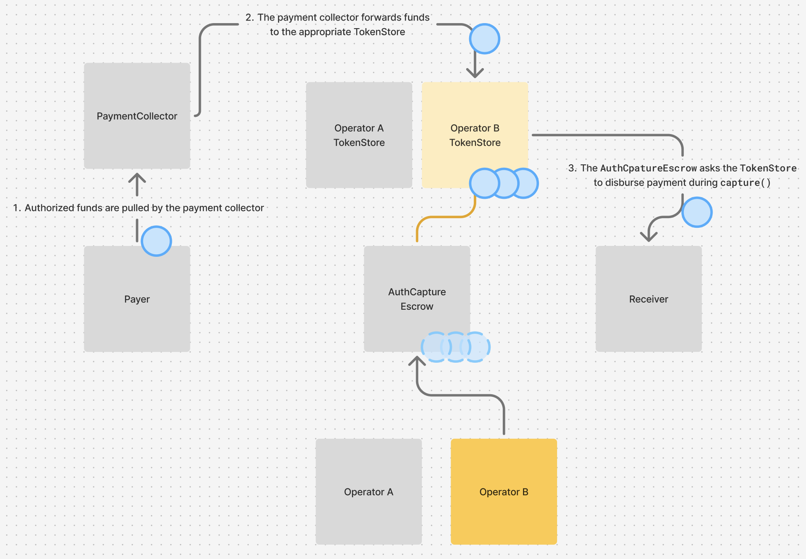

# Audits

Audited by [Spearbit](https://spearbit.com/).

| Audit | Date | Report |
|--------|---------|---------|
| First private audit | 04/01/2025 | [Report](../audits/Cantina-Report-04-01-2025.pdf) |
| Second private audit | 04/22/2025 | [Report](../audits/Cantina-Report-04-22-2025.pdf) |

# Security Analysis

## Protocol Guarantees

### Operator constraints
To abstract many of the complexities for merchants and payers, we introduce the concept of a protocol “operator”. The primary job of an operator is to facilitate a payment’s transitions through its lifecycle. An operator submits transactions onchain to initiate, complete or cancel payments, covering the gas requirements of those transactions and simplifying the integration process for less technical end users. If an operator were trusted to custody or manage payment liquidity, this entity would become a magnet for attackers and its compromise could lead to catastrophic loss of funds. A core philosophy of the protocol seeks to minimize trust in any single party while maximizing protective guarantees for all participants.

To avoid placing centralized trust or control in the hands of an operator, the protocol itself tightly defines how, where, and when funds can move. Operators are responsible for triggering state transitions within the protocol, but the protocol constrains which state transitions are valid and enforces that payer funds can only move in the context of a payment the payer has authorized. When payers authorize payments, they cryptographically sign complete payment terms: exact amounts, recipients, fee structures, timing constraints, funding authorization and, importantly, the specific operator who is allowed to facilitate state changes for the payment. The hashed data of a unique payment’s terms and the payer’s signature across this information enables a cryptographically enforced guarantee by the protocol that makes it impossible for operators to modify terms, reuse payer authorizations for different payments, or trigger state transitions for payments they’re not authorized by. At worst, operators can become inactive or censor payments, and the protocol includes a time-locked fund retrieval mechanism to protect payers even in this case.

The protocol is permissionless and immutable by design; anyone can act as an operator of the protocol. Operators can be payment processors like Shopify, independent service providers, payers or merchants themselves, or even smart contracts that implement custom business logic. Each payment is cryptographically tied to a specific operator, and that operator’s control over funds is tightly constrained by the guarantees of the protocol.

### Unique payments
The protocol uniquely identifies payments via a hash of the [`PaymentInfo`](../src/AuthCaptureEscrow.sol#L26-L52) struct, the chain id, and the contract address calculating the hash, making payments unique per-chain and per-instance of the `AuthCaptureEscrow`. This data structure defines the operator who’s allowed to facilitate the payment’s state transitions, the terms of the token transfer (token, payer, receiver, amount), fee constraints, the various expiration timestamps for the payment’s lifecycle, and an additional source of entropy for achieving uniqueness. Any given payment can only ever be authorized once. The cryptographic hash of this structure identifies the payment and is part of what the payer signs when they authorize a token transfer for the payment.

### Time-Based Protections
Time serves as a crucial protection mechanism throughout the payment lifecycle, preventing payments (and associated liquidity) from ending up in a stuck state. The protocol uses three distinct time-based safeguards, defined in the `PaymentInfo` structure, that when passed change what’s possible for a payment. The payment’s `preApprovalExpiry` is the point after which a payment can no longer be authorized. This prevents stale authorizations and ensures payers aren't committed indefinitely to an authorization they have signed. The `authorizationExpiry` defines the point at which the authorization period for the payment expires and a payment is no longer capturable. At this point, any authorized funds become reclaimable via reclaim by the payer themselves. Finally, the `refundExpiry` defines the point after which a payment can no longer be refunded in-protocol, providing eventual finality for that payment. The time-based protections work automatically through smart contract logic and create predictable windows where different actions are possible, preventing any party from being stuck indefinitely.

### Liquidity Segmentation in Operator `TokenStore`s

The `AuthCaptureEscrow` is a singleton designed to be used by many operators. This could lead to a significant amount of escrowed liquidity held in a single honeypot. While the `AuthCaptureEscrow` has been thoroughly audited and is explicitly protected from re-entrancy, there is always the possibility of an unfound bug. The worst-case effects of such a possible bug would be the ability to drain liquidity from the escrow contract, and even more severely, to drain liquidity that was obtained by other/all operators.

As a hedge against this worst-case outcome, we introduced per-operator [`TokenStore`](../src/TokenStore.sol) contracts that serve as simple liquidity vaults for each unique operator. Instead of storing all escrowed funds in the `AuthCaptureEscrow`, escrowed funds for a given operator are stored in a dedicated `TokenStore` contract deployed at an address deterministically derived from the specific operator currently interacting with the protocol. All points of interaction with these TokenStores from the `AuthCaptureEscrow` are mediated by the derivation of the specific operator's `TokenStore` address, reducing the possibility of cross-operator interference with held liquidity. A `TokenStore` is only callable by the `AuthCaptureEscrow`.

  
  
<em>Per-operator TokenStores hold liquidity</em>

## Risks and Mitigations

### Operator compromise
The protocol is designed to limit the scope of damage that can occur in the case that an operator for existing payments is compromised by a malicious actor. Operators cannot steal funds from the 
protocol. Malicious or inactive operators can censor payments by failing to move a payment through its lifecycle or by prematurely voiding payments. Operators may also have some jurisdiction over how fees behave, depending on how they were configured in the original `PaymentInfo` definition. Operators can apply fees up to the `maxFeeBps` specified in the `PaymentInfo`, and, if the `feeReceiver` was set as `address(0)` in the `PaymentInfo` then this value is dynamically configurable at call time. Therefore in the worst case, an operator could siphon the maximum configurable fee rate to an address of their choosing.

### Malicious Token Collectors
(See [Token Collectors](./TokenCollectors.md) for complete documentation)

The `AuthCaptureEscrow` protects against malicious or incompetent token collectors by:
- Measuring balance changes to ensure collector compliance
- Using Solady's `ReentrancyGuard` to protect all public functions from reentrancy

The choice of `TokenCollector` used to source liquidity for payments and refunds is unconstrained, as is the calldata passed to that contract. This type of open-ended external call should immediately raise security concerns as this pattern is often the source of bugs related to reentrancy. The `AuthCaptureEscrow` protects against malicious token collectors in several ways. The escrow contract performs a balance check after calling out to the token collector to ensure the expected funds for the payment have been received by the operator's `TokenStore`. Importantly, all public non-view functions on the `AuthCaptureEscrow` are `NonReentrant`, preventing reentrancy attacks from token collectors that would attempt to confuse the `AuthCaptureEscrow` about the state this accounting while authorizing a given payment. Finally, as described above, liquidity is segmented per-operator, a mitigation that is on its own sufficient to protect against known reentrancy attacks, even if all functions were not explicitly protected with a reentrancy guard.

Token collectors are still granted a significant amount of trust by payers. When authorizing a payment, whether with a signature-based method like ERC-3009 and Permit2, or with a direct ERC-20 approval, the payer is authorizing the token collector as a spender of their funds. It's important that any collector a payer authorizes is implemented in a way that ensures funds can only be collected for the purpose of that specific payment. For example, the collector should derive a nonce that is uniquely determined by the payment information and the collector should only allow calls from the `AuthCaptureEscrow`. Failure to enforce these properties could allow a token collector to move payer funds on behalf of a different payment, or outside the context of payments altogether. Note that this category of risk is present in all cases where a user is producing a signature and is not unique to or defensible by this protocol.

### Denial of service due to denylists
Some tokens, such as USDC, implement denylists that prohibit the movement of funds to or from a 
blocked address. Due to the atomic nature of transactions onchain, if any of the transfers involved in the movement of a payment's funds fail, that step in the payment's lifecycle can't be completed. This is of particular concern for payments that may have already been authorized, kicking off the fulfillment of a purchase, and cannot later be captured due to a blocked recipient or `feeReceiver`. Capturing fees may be considered of lesser importance to a given operator than maintaining liveness in the protocol and fulfilling pending payments, making a denylisted `feeReceiver` an unacceptable reason for failing to fulfill payments. We explored design options for mitigating this risk in the core protocol, such as holding failed fee funds in custody for later retrieval, but the complexity of this mechanism wasn't justified by the magnitude of this edge case.

The `feeReceiver` can be a dynamic argument if the `feeReceiver` specified in the `PaymentInfo` is `address(0)`. For operators that care to prioritize liveness of payments over the risk of fees lost due to operator compromise, setting the value of `feeReceiver` to `address(0)` in the initial `PaymentInfo` is a way to mitigate the risk of being permanently unable to fulfill a given payment due to denylists; the operator can simply supply an alternate `feeReceiver` to the `capture` call (for any number of necessary attempts).

