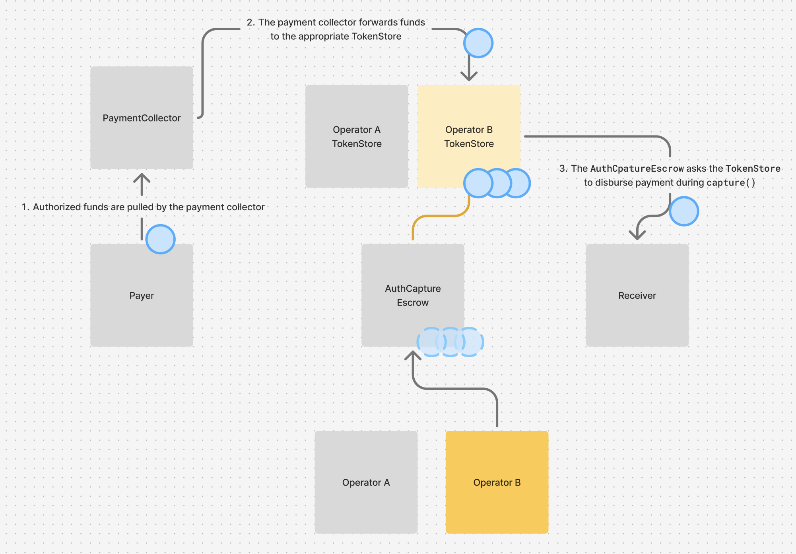

## Security Features

### Payment Validation and Invariants
- **Amount limits**: Enforced via `maxAmount` parameter
- **Time constraints**: Multiple expiry timestamps prevent stale payments
- **Fee validation**: Configurable min/max fee ranges
- **Immutable terms**: All critical parameters signed by buyer, making it enforceable that a given buyer's signature can't be used for a different payment than intended

### Access Control
- **Operator-only**: Most functions restricted to designated operator
- **Buyer reclaim**: Only buyers can reclaim after authorization expiry
- **Collector validation**: Ensures correct collector type for each operation

### Reentrancy Protection
- Uses Solady's `ReentrancyGuard` to protect all public functions from reentrancy

### Liquidity Segementation in Operator `TokenStore`s

The `AuthCaptureEscrow` is a singleton designed to be used by many operators. This could lead to a significant amount of escrowed liquidity held in a single honeypot. While the `AuthCaptureEscrow` has been thoroughly audited and is explicitly protected from re-entrancy, there is always the possibility of an unfound bug. The worst-case effects of such a possible bug would be the ability to drain liquidity from the escrow contract, and even more severely, to drain liquidity that was obtained by other/all operators.

As a hedge against this worst-case outcome, we introduced per-operator `TokenStore` contracts that serve as simple liquidity vaults for each unique operator. Instead of storing all escrowed funds in the `AuthCaptureEscrow`, escrowed funds for a given operator are stored in a dedicated `TokenStore` contract deployed at an address deterministically derived from the specific operator currently interacting with the protocol. All points of interaction with these TokenStores from the `AuthCaptureEscrow` are mediated by the derivation of the specific operator's TokenStore address, reducing the possibility of cross-operator interference with held liquidity. A `TokenStore` is only callable by the `AuthCaptureEscrow`

  
  
<em>Per-operator TokenStores hold liquidity</em>

### Balance Verification
- Validates exact token amounts transferred to prevent partial payments
- Measures balance changes to ensure collector compliance

## Risks and Mitigations

### Operator compromise
The protocol is designed to limit the scope of damage that can occur in the case that an operator for existing payments is compromised by a malicious actor. Operators cannot steal funds from the 
protocol. Malicious or inactive operators can censor payments by failing to move a payment through its lifecycle or by prematurely voiding payments. Operators may also have some jurisdiction over how fees behave, depending on how they were configured in the original `PaymentInfo` definition. Operators can apply fees up to the `maxFeeBps` specified in the `PaymentInfo`, and, if the `feeReceiver` was set as `address(0)` in the `PaymentInfo` then this value is dynamically configurable at call time. Therefore in the worst case, an operator could siphon the maximum configurable fee rate to an address of their choosing.

### Denial of service due to denylists
Some tokens, such as USDC, implement denylists that prohibit the movement of funds to or from a 
blocked address. Due to the atomic nature of transactions onchain, if any of the transfers involved in the movement of a payment's funds fail, that step in the payment's lifecycle can't be completed. This is of particular concern for payments that may have already been authorized, kicking off the fulfillment of a purchase, and cannot later be captured due to a blocked recipient or `feeReceiver`. Capturing fees may be considered of lesser importance to a given operator than maintaining liveness in the protocol and fulfilling pending payments, making a denylisted `feeReceiver` an unacceptable reason for failing to fulfill payments. We explored design options for mitigating this risk in the core protocol, such as holding failed fee funds in custody for later retrieval, but the complexity of this mechanism wasn't justified by the magnitude of this edge case.

The `feeReceiver` can be a dynamic argument if the `feeReceiver` specified in the `PaymentInfo` is `address(0)`. For operators that care to prioritize liveness of payments over the risk of fees lost due to operator compromise, setting the value of `feeReceiver` to `address(0)` in the initial `PaymentInfo` is a way to mitigate the risk of being permanently unable to fulfill a given payment due to denylists; the operator can simply supply an alternate `feeReceiver` to the `capture` call (for any number of necessary attempts). 

