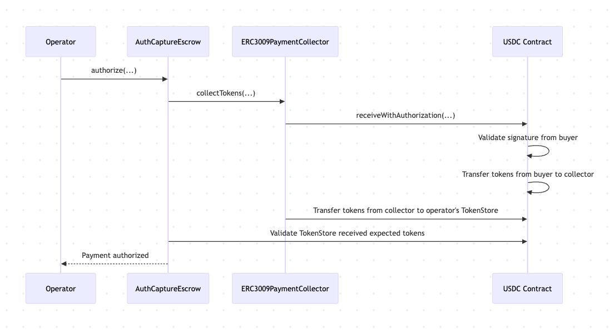

## Token Collectors

One of the biggest challenges in building onchain payment infrastructure is the fragmented landscape of token authorization methods. When payers need to authorize spending without directly initiating transactions themselves (enabling gasless, asynchronous, operator-driven experiences) there are multiple competing standards, each with distinct tradeoffs.

ERC-3009, implemented by USDC and several major stablecoins, offers elegant single-signature UX with non-sequential nonces, but isn't widely adopted by most ERC-20 tokens. Permit2 provides universal compatibility with any ERC-20 token but requires an initial setup step per token, creating friction on first use. Spend Limits deliver optimal experiences for specific smart wallet implementations like Coinbase Smart Wallet, but with limited compatibility. Traditional ERC-20 approvals work everywhere but require separate transactions and can't be gasless.

This fragmentation creates a difficult choice: picking one standard imposes an opinion on the protocol and excludes users of incompatible tokens and wallets. Building multiple mechanisms into the protocol is slightly more inclusive but ultimately a fractal of the original problem. Regardless of our implementation choice, the landscape of options will continue evolving as wallet technology matures and new standards emerge.

Rather than make this choice, we designed the protocol to be completely agnostic about token authorization methods. The solution is a modular "token collector" system that abstracts away the specific spending mechanism while maintaining security guarantees.

<div align="center">
  
  <p><em>Token collectors can be designed to interface with various spending mechanisms</em></p>
</div>


Token collectors handle the actual movement of funds from payers to escrow, but the `AuthCaptureEscrow` doesn't care how they work, it simply specifies required amounts and verifies through balance checks that funds were received. Operators can choose the optimal collector for each payment based on the payer's wallet and token combination. The collector implements the specific logic for redeeming authorization (whether ERC-3009 signatures, Permit2 calls, or any other method) while the core protocol remains unchanged.

<div align="center">
  
  <p><em>An example call flow during authorization using the ERC3009PaymentCollector.</em></p>
</div>


This abstraction makes the system future-proof and universally compatible. As new authorization standards emerge or wallet technology evolves, developers can simply implement new collectors without modifying the core protocol. The result is a payment infrastructure that works with the long tail of tokens and wallets while maintaining trustless security guarantees for all participants.


### Collector implementation

Token collectors are arbitrarily specifiable arguments determined by operators and therefore are not trusted by the protocol. The protocol protects itself against malicious or poorly implemented token collectors through reentrancy protection and balance checks that ensure the collector has delivered the tokens expected by the protocol. Token collectors are, however, trusted by the payers who authorize them to spend funds. When payers authorize payments, they're authorizing a specific token collector to spend their funds, making proper collector implementation crucial. In the same way that all cryptographic signatures are critical operations, payers should not sign authorizations for token collectors that are not properly implemented.

Honestly implemented collectors must derive payment-specific nonces to be included in (and cryptographically tie the complete payment terms to) the actual signature scheme (i.e. ERC-3009, Permit2 etc.) that the payer is actually producing. This ensures each authorization can only be used for its intended payment. Collectors must also restrict access to their collectTokens method to only the AuthCaptureEscrow, which prevents unauthorized movement of funds outside the context of the protocol’s execution.


 There are two types of collectors:
- Payment collectors handle the initial transfer of funds from payer to escrow. 
- Refund collectors facilitate the return of funds to payers by providing refund liquidity.

**_A separation of payment and refund collectors prevents residual, unspent balances from an original payment authorization granted to a payment collector from being used to cover a refund._**

## `TokenCollector.sol` 

The `TokenCollector` abstract base contract defines the expected interface that all token collectors must implement.

### Core Interface Requirements

**1. Collector Type Identification**

```solidity
function collectorType() external view returns (CollectorType);
```

Every collector must declare whether it handles payments or refunds via the `CollectorType` enum (`Payment` or `Refund`). The `AuthCaptureEscrow` validates this type matches the operation being performed, ensuring payment collectors can't be used for refunds and vice versa. This prevents the possibility of using residual payment authorization balances to cover refunds.

**2. Token Collection Function**

```solidity
function collectTokens(
    AuthCaptureEscrow.PaymentInfo calldata paymentInfo,
    address tokenStore,
    uint256 amount,
    bytes calldata collectorData
) external;
```

This is the primary interface called by `AuthCaptureEscrow` to execute token transfers. Collectors implement their specific authorization logic in the internal `_collectTokens` function—whether that's ERC-3009 signatures, Permit2 transfers, traditional approvals, or any other mechanism. The `collectorData` parameter allows passing collector-specific information like signatures or approval proofs. The base contract enforces that only the `AuthCaptureEscrow` can call `collectTokens`, preventing unauthorized token collection. Individual collector implementations must ensure their authorization mechanisms (signatures, approvals, etc.) are properly implemented to prevent reuse across different payments or unauthorized access to user funds.

**3. Payer-Agnostic Hash Utility**

```solidity
function _getHashPayerAgnostic(AuthCaptureEscrow.PaymentInfo memory paymentInfo) internal view returns (bytes32);
```

This utility function addresses a common pattern in offchain payment construction: creating payment messages before knowing which specific wallet will sign them. The function temporarily sets the `payer` field to `address(0)`, computes the payment hash, then restores the original payer address. This payer-agnostic hash can be used as the cryptographic link between the complete details of the payment and the signature provided by the payer. This pattern is safe because the actual payer address is recovered during signature verification and therefore can't be forged.


## Implemented Collectors

The protocol launches with implemented collectors supporting the following major authorization patterns:

- [**ERC-3009**](https://eips.ethereum.org/EIPS/eip-3009)
- [**Permit2**](https://docs.uniswap.org/contracts/permit2/overview)
- [**ERC-20 pre-approval**](https://docs.openzeppelin.com/contracts/5.x/api/token/erc20#ERC20-approve-address-uint256-)
- [**Spend Limits**](https://docs.base.org/identity/smart-wallet/concepts/features/optional/spend-limits)
- **Operator-funded refunds**

### [`ERC3009PaymentCollector`](../src/collectors/ERC3009PaymentCollector.sol)
**Use case**: Tokens supporting ERC-3009 (including USDC)
- Uses `receiveWithAuthorization` for gasless, signature-based transfers
- Supports ERC-6492 for smart contract wallet signatures
- Simple single-signature UX for tokens that implement, including USDC, but not widely implemented by most ERC-20s

### [`Permit2PaymentCollector`](../src/collectors/Permit2PaymentCollector.sol)
**Use case**: Any ERC-20 token via Permit2
- Universal token compatibility through Permit2's signature-based transfers
- Requires users to first approve Permit2 contract per-token
- Good fallback option for tokens without native signature support
- Supports ERC-6492 for smart contract wallet signatures

### [`PreApprovalPaymentCollector`](../src/collectors/PreApprovalPaymentCollector.sol)
**Use case**: Traditional ERC-20 tokens with pre-approval flow
- Requires explicit pre-approval step by payer before authorization
- Uses standard `transferFrom` after approval
- Compatible with all tokens but requires two transactions

### [`SpendPermissionPaymentCollector`](../src/collectors/SpendPermissionPaymentCollector.sol)
**Use case**: Best UX for Coinbase Smart Wallet users, can cover subscription payment schedules
- Single-signature UX for payer
- Supports ERC-6492 for smart contract wallet signatures via native support in `SpendPermissionManager`
- Only compatible with Coinbase Smart Wallet users
- Enables subscription-like recurring payments

### [`OperatorRefundCollector`](../src/collectors/OperatorRefundCollector.sol)
**Use case**: Operator-funded refunds
- Pulls refund funds from operator's balance
- Uses standard ERC-20 approval from operator to collector
- Basic implementation example of modularizing the source of refund liquidity
