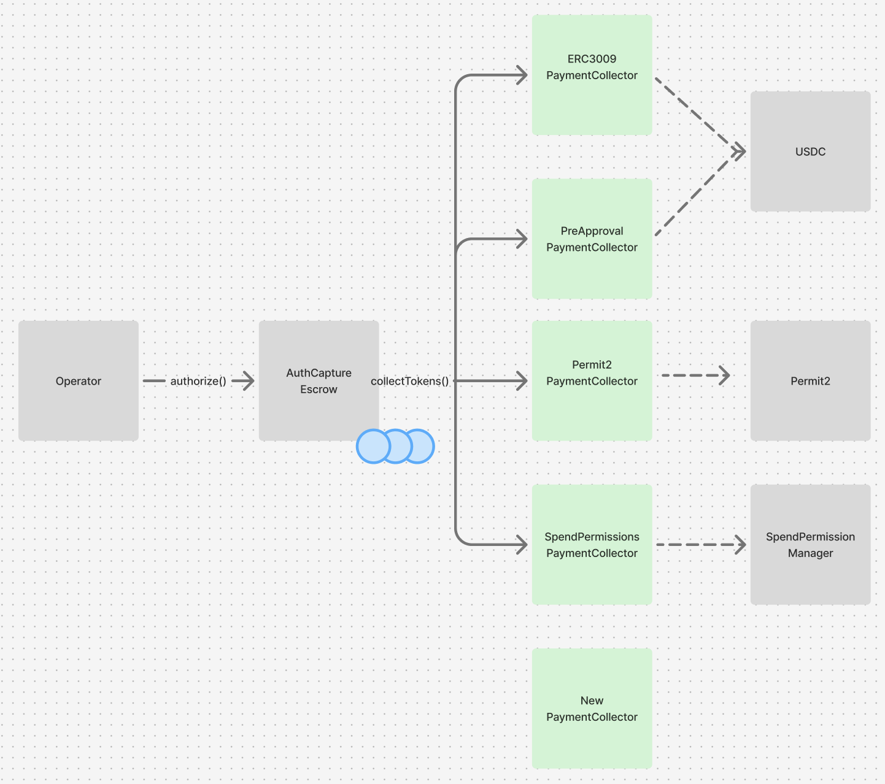

## Token Collectors


The protocol supports arbitrary, extensible token collection strategies through modular collector contracts for both payments and refunds. This allows any existing or new mechanism for delegated spending to be used by the `AuthCaptureEscrow` to move payers' funds. This enables protocol integrations to provide the best available UX for a given combination of wallet and token.

During a payment authorization or direct charge, the `AuthCaptureEscrow` contract makes a call to a token collector that is specified, along with its calldata, as an argument by the operator. The `AuthCaptureEscrow` is agnostic to the implementation of the token collector, and simply checks to ensure it has received funding for the payment. All functions on the `AuthCaptureEscrow` are non-reentrant, to protect against maliciously implemented token collectors that could seek to confuse the `AuthCaptureEscrow` about the state of a payment's funding.


<div align="center">
  
  <p><em>Token collectors can be designed to interface with various spending mechanisms</em></p>
</div>


 There are two types of collectors:
- Payment collectors handle the initial transfer of funds from payer to escrow. 
- Refund collectors facilitate the return of funds to payers by providing refund liquidity.

**_A separation of payment and refund collectors prevents residual, unspent balances from an original payment authorization granted to a payment collector from being used to cover a refund._**

## `TokenCollector.sol` 

The `TokenCollector` abstract base contract defines the expected interface that all token collectors must implement.

### Core Interface Requirements

**1. Collector Type Identification**

```solidity
function collectorType() external view returns (CollectorType);
```

Every collector must declare whether it handles payments or refunds via the `CollectorType` enum (`Payment` or `Refund`). The `AuthCaptureEscrow` validates this type matches the operation being performed, ensuring payment collectors can't be used for refunds and vice versa. This prevents the possibility of using residual payment authorization balances to cover refunds.

**2. Token Collection Function**

```solidity
function collectTokens(
    AuthCaptureEscrow.PaymentInfo calldata paymentInfo,
    address tokenStore,
    uint256 amount,
    bytes calldata collectorData
) external;
```

This is the primary interface called by `AuthCaptureEscrow` to execute token transfers. Collectors implement their specific authorization logic in the internal `_collectTokens` function—whether that's ERC-3009 signatures, Permit2 transfers, traditional approvals, or any other mechanism. The `collectorData` parameter allows passing collector-specific information like signatures or approval proofs. The base contract enforces that only the `AuthCaptureEscrow` can call `collectTokens`, preventing unauthorized token collection. Individual collector implementations must ensure their authorization mechanisms (signatures, approvals, etc.) are properly implemented to prevent reuse across different payments or unauthorized access to user funds.

**3. Payer-Agnostic Hash Utility**

```solidity
function _getHashPayerAgnostic(AuthCaptureEscrow.PaymentInfo memory paymentInfo) internal view returns (bytes32);
```

This utility function addresses a common pattern in offchain payment construction: creating payment messages before knowing which specific wallet will sign them. The function temporarily sets the `payer` field to `address(0)`, computes the payment hash, then restores the original payer address. This payer-agnostic hash can be used as the cryptographic link between the complete details of the payment and the signature provided by the payer. This pattern is safe because the actual payer address is recovered during signature verification and therefore can't be forged.


## Implemented Collectors
### [`ERC3009PaymentCollector`](../src/collectors/ERC3009PaymentCollector.sol)
**Use case**: Tokens supporting ERC-3009 (including USDC)
- Uses `receiveWithAuthorization` for gasless, signature-based transfers
- Supports ERC-6492 for smart contract wallet signatures
- Simple single-signature UX for tokens that implement, including USDC, but not widely implemented by most ERC-20s

### [`Permit2PaymentCollector`](../src/collectors/Permit2PaymentCollector.sol)
**Use case**: Any ERC-20 token via Permit2
- Universal token compatibility through Permit2's signature-based transfers
- Requires users to first approve Permit2 contract per-token
- Good fallback option for tokens without native signature support
- Supports ERC-6492 for smart contract wallet signatures

### [`PreApprovalPaymentCollector`](../src/collectors/PreApprovalPaymentCollector.sol)
**Use case**: Traditional ERC-20 tokens with pre-approval flow
- Requires explicit pre-approval step by payer before authorization
- Uses standard `transferFrom` after approval
- Compatible with all tokens but requires two transactions

### [`SpendPermissionPaymentCollector`](../src/collectors/SpendPermissionPaymentCollector.sol)
**Use case**: Best UX for Coinbase Smart Wallet users, can cover subscription payment schedules
- Single-signature UX for payer
- Supports ERC-6492 for smart contract wallet signatures via native support in `SpendPermissionManager`
- Only compatible with Coinbase Smart Wallet users
- Enables subscription-like recurring payments

### [`OperatorRefundCollector`](../src/collectors/OperatorRefundCollector.sol)
**Use case**: Operator-funded refunds
- Pulls refund funds from operator's balance
- Basic implementation example of modularizing the source of refund liquidity
