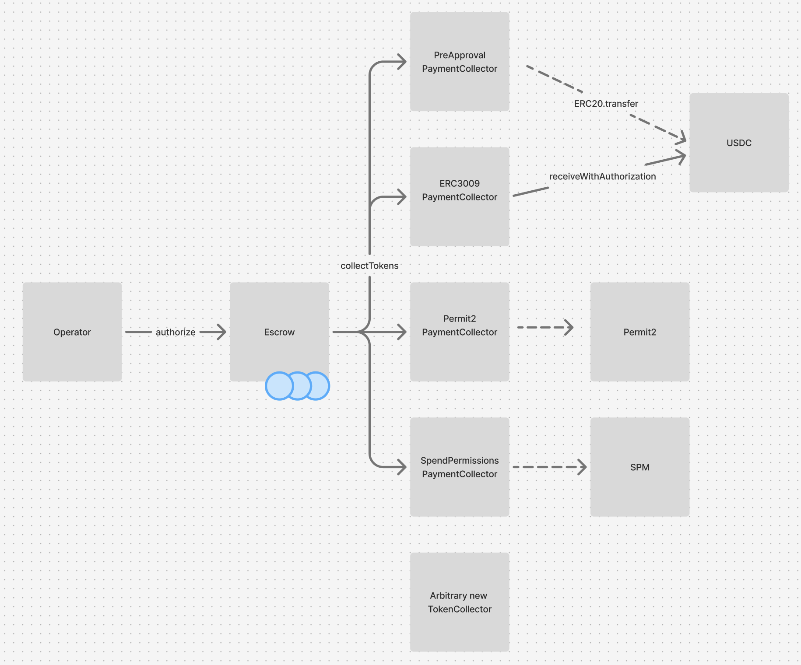

## Token Collectors

The protocol supports arbitrary, extensible token collection strategies through modular collector contracts for both payments and refunds.
This allows any existing or new mechanism for delegated spending to be used by the `AuthCaptureEscrow` to move payers' funds. This enables protocol integrations to provide the best available UX for a given combination of wallet and token.

During a payment authorization or direct charge, the `AuthCaptureEscrow` contract makes a call to a token collector that is specified, along with its calldata, as an argument by the operator. The `AuthCaptureEscrow` is agnostic to the implementation of the token collector, and simply checks to ensure it has received funding for the payment. All functions on the `AuthCaptureEscrow` are non-reentrant, to protect against maliciously implemented token collectors that could seek to confuse the `AuthCaptureEscrow` about the state of a payment's funding.

  
  
<em>Token collectors can be designed to interface with various spending mechanisms</em>

 There are two types of collectors:
- Payment collectors handle the initial transfer of funds from buyer to escrow. 
- Refund collectors facilitate the return of funds to buyers by providing refund liquidity.

**_A separation of payment and refund collectors prevents residual, unspent balances from an original payment authorization granted to a payment collector from being used to cover a refund._**

## Implemented Collectors
### `ERC3009PaymentCollector`
**Use case**: Tokens supporting ERC-3009 (like USDC)
- Uses `receiveWithAuthorization` for gasless, signature-based transfers
- Supports ERC-6492 for smart contract wallet signatures
- Simple single-signature UX for tokens that implement, including USDC, but not widely implemented by most ERC-20s

### `Permit2PaymentCollector`
**Use case**: Any ERC-20 token via Permit2
- Universal token compatibility through Permit2's signature-based transfers
- Requires users to first approve Permit2 contract per-token
- Good fallback option for tokens without native signature support
- Supports ERC-6492 for smart contract wallet signatures

### `PreApprovalPaymentCollector`
**Use case**: Traditional ERC-20 tokens with pre-approval flow
- Requires explicit pre-approval step by payer before authorization
- Uses standard `transferFrom` after approval
- Compatible with all tokens but requires two transactions

### `SpendPermissionPaymentCollector`
**Use case**: Best UX for Coinbase Smart Wallet users, can cover subscription payment schedules
- Single-signature UX for buyer
- Supports ERC-6492 for smart contract wallet signatures via native support in `SpendPermissionManager`
- Only compatible with Coinbase Smart Wallet users
- Enables subscription-like recurring payments

### `OperatorRefundCollector`
**Use case**: Operator-funded refunds
- Pulls refund funds from operator's balance
- Basic implementation example of modularizing the source of refund liquidity
