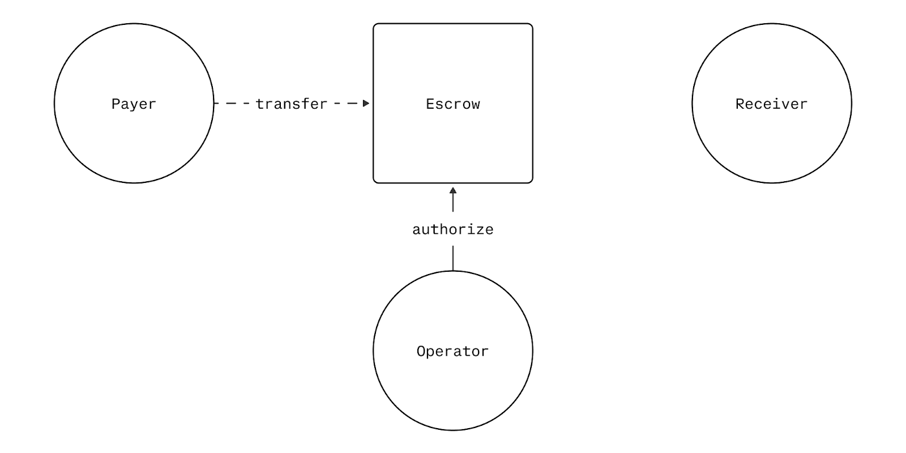

# Authorize

The `authorize` function places a hold on payer funds by transferring them into escrow, where they await capture by the operator. This implements the "authorization" phase of the two-phase payment pattern.

<div align="center">
  
  <p><em>Authorization</em></p>
</div>

## Purpose

Authorization serves as a payment reservation mechanism that:
- **Guarantees merchant payment**: Once authorized, funds are guaranteed to be available for capture
- **Provides payer protection**: Funds remain in escrow until explicitly captured or expired
- **Enables delayed settlement**: Merchants can fulfill orders knowing payment is secured
- **Supports partial captures**: The full authorized amount can be captured in multiple increments

## How It Works

```solidity
function authorize(
    PaymentInfo calldata paymentInfo,
    uint256 amount,
    address tokenCollector,
    bytes calldata collectorData
) external nonReentrant onlySender(paymentInfo.operator) validAmount(amount)
```

### Process Flow
1. **Validation**: Ensures payment info is valid, amount doesn't exceed limits, and timing constraints are met
2. **Uniqueness Check**: Verifies this payment hasn't already been collected
3. **Token Collection**: Uses the specified token collector to pull funds from the payer
4. **State Update**: Records the authorized amount as `capturableAmount`
5. **Event Emission**: Emits `PaymentAuthorized` for tracking

### Key Validations
- `amount` must not exceed `paymentInfo.maxAmount`
- Current time must be before `paymentInfo.preApprovalExpiry`
- Payment must not have been previously collected
- Token collector must successfully transfer exact amount to TokenStore

## Parameters

| Parameter | Type | Description |
|-----------|------|-------------|
| `paymentInfo` | `PaymentInfo` | Complete payment configuration (operator, payer, receiver, etc.) |
| `amount` | `uint256` | Amount to authorize (must be ≤ paymentInfo.maxAmount) |
| `tokenCollector` | `address` | Contract that will pull tokens from payer |
| `collectorData` | `bytes` | Data passed to token collector (e.g., signature) |

## Access Control

- **Operator Only**: Only `paymentInfo.operator` can call this function for the given `PaymentInfo`
- **Single Use**: Each payment can only be authorized once
- **Time Bounded**: Must be called before `preApprovalExpiry`

## State Changes

### Before Authorization
```
PaymentState {
    hasCollectedPayment: false,
    capturableAmount: 0,
    refundableAmount: 0
}
```

### After Authorization
```
PaymentState {
    hasCollectedPayment: true,
    capturableAmount: <authorized_amount>,
    refundableAmount: 0
}
```

## Events

```solidity
event PaymentAuthorized(
    bytes32 indexed paymentInfoHash,
    PaymentInfo paymentInfo,
    uint256 amount,
    address tokenCollector
);
```

Track authorizations using the `paymentInfoHash` which uniquely identifies each payment across chains and contracts.

## Error Conditions

| Error | Cause |
|-------|--------|
| `InvalidSender` | Caller is not the designated operator |
| `ZeroAmount` | Attempting to authorize zero amount |
| `AmountOverflow` | Amount exceeds uint120 maximum |
| `ExceedsMaxAmount` | Amount exceeds paymentInfo.maxAmount |
| `AfterPreApprovalExpiry` | Called after signature expiry |
| `InvalidExpiries` | Expiry timestamps are improperly ordered |
| `FeeBpsOverFlow` | maxFeeBps exceeds maximum value |
| `InvalidFeeBpsRange` | minFeeBps exceeds maxFeeBps |
| `PaymentAlreadyCollected` | Payment already authorized or charged |
| `InvalidCollectorForOperation` | Wrong collector type specified |
| `TokenCollectionFailed` | Token transfer didn't match expected amount |
