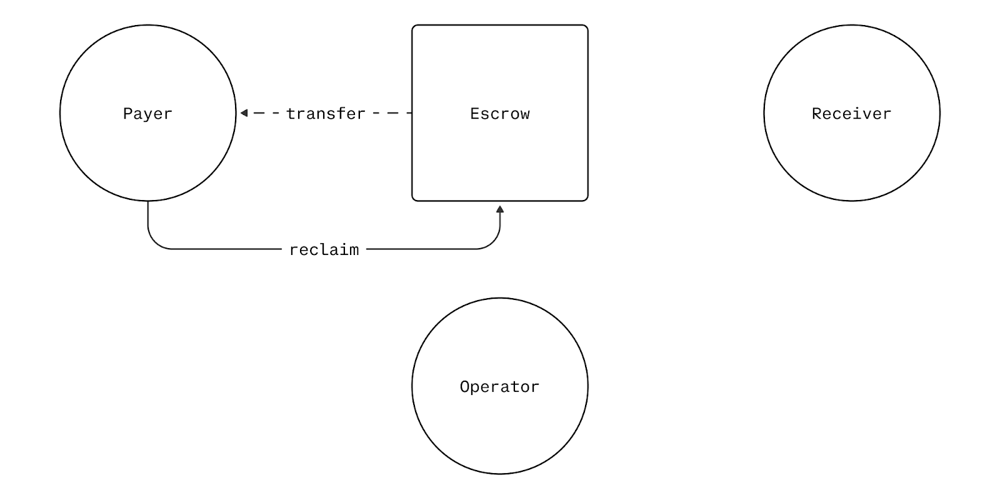

# Reclaim

The `reclaim` function allows payers to recover their funds from escrow after the authorization expiry period has passed. This provides a safety mechanism ensuring payers can always retrieve their funds from abandoned or unfulfilled payments.

<div align="center">
  
  <p><em>Reclaim</em></p>
</div>

## Purpose

Reclaim protects payers by:
- **Payer-controlled recovery**: Puts fund recovery control in payer's hands
- **Preventing permanent fund loss**: Guarantees payers can recover escrowed funds
- **Handling abandoned payments**: Addresses cases where operators don't capture or void before authorization expiry

## How It Works

```solidity
function reclaim(PaymentInfo calldata paymentInfo) 
    external nonReentrant onlySender(paymentInfo.payer)
```

### Process Flow
1. **Timing Validation**: Ensures current time is after `authorizationExpiry`
2. **Authorization Check**: Verifies that capturable funds exist for the payment
3. **State Clearing**: Sets `capturableAmount` to zero permanently
4. **Fund Return**: Transfers all capturable funds back to the payer
5. **Event Emission**: Emits `PaymentReclaimed` for tracking

## Parameters

| Parameter | Type | Description |
|-----------|------|-------------|
| `paymentInfo` | `PaymentInfo` | Original payment configuration identifying the payment to reclaim |

## Access Control

- **Payer Only**: Only `paymentInfo.payer` can call this function
- **Requires Liquidity**: Payment must have non-zero `capturableAmount`, but can be partially captured
- **Time Restricted**: Can only be called after `authorizationExpiry`

## State Changes

### Before Reclaim
```
PaymentState {
    hasCollectedPayment: true,
    capturableAmount: 1000e6,  // $1000 USDC still authorized
    refundableAmount: 0
}
```

### After Reclaim
```
PaymentState {
    hasCollectedPayment: true,
    capturableAmount: 0,       // Cleared - cannot capture anymore
    refundableAmount: 0        // No refundable amount (funds returned)
}
```

## Events

```solidity
event PaymentReclaimed(
    bytes32 indexed paymentInfoHash,
    uint256 amount
);
```

Track reclaimed payments for analytics and user notifications.

## Error Conditions

| Error | Cause |
|-------|--------|
| `InvalidSender` | Caller is not the original payer |
| `BeforeAuthorizationExpiry` | Called before authorization expiry time |
| `ZeroAuthorization` | Payment has no capturable amount to reclaim |
